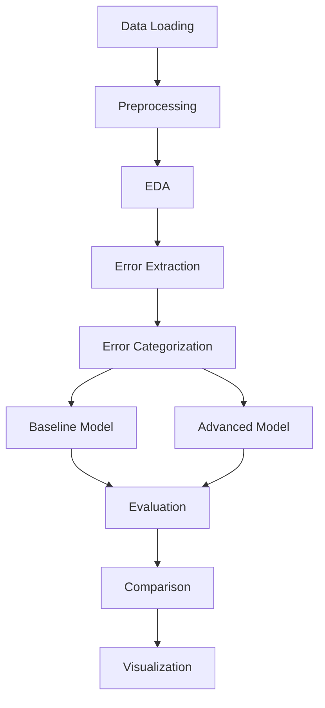

# ASR Noun Enhancement Assignment

This project implements a spell correction system for Automatic Speech Recognition (ASR) noun enhancement, focusing on correcting medication names and medical terminology in general medical conversations.

## Pipeline Overview



## Installation

1. Clone the repository:
```bash
git clone <repository-url>
cd ASR_Noun_Enhancement
```

2. Install dependencies:
```bash
pip install -r requirements.txt
```

Or using uv:
```bash
uv sync
```

## Usage

### Running the Complete Pipeline

1. **Data Preparation**:
```bash
python src/data_processing/eda.py  # Preprocessing and EDA
```

2. **Error Extraction**:
```bash
python src/data_processing/pipeline.py  # Build error database
```

3. **Train Baseline Model**:
```bash
python src/models/baseline.py  # Train and evaluate baseline
```

4. **Train Advanced Model**:
```bash
python src/models/advanced.py   # Train T5 model
python src/models/advanced_eval.py  # Evaluate T5 model
```

5. **Comparison and Visualization**:
```bash
python src/evaluation/compare.py  # Compare models
python src/evaluation/plots.py    # Generate plots
```

### Jupyter Notebook

For an interactive experience, use the comprehensive notebook:

[](https://colab.research.google.com/github/sithtsar/ASR-Noun-Enhancement/blob/main/notebooks/notebook.ipynb)

The notebook includes:
- Step-by-step implementation
- Data exploration
- Model training and evaluation
- Visualizations

## Project Structure

```
├── data/                        # Raw dataset files
│   └── processed/               # Processed data (CSVs, JSONs)
├── docs/                        # Documentation and assignment
├── models/                      # Trained models and checkpoints
├── notebooks/                   # Jupyter notebooks
├── plots/                       # Visualization images
├── scripts/                     # Entry point scripts
├── src/                         # Source code
│   ├── data_processing/         # Data preprocessing and EDA
│   ├── models/                  # Model training and evaluation
│   └── evaluation/              # Model comparison and plotting
├── pyproject.toml               # Project dependencies
├── requirements.txt             # Alternative dependency list
└── README.md                    # This file
```

## Models and Metrics

### Baseline Model
- Dictionary lookup using error database
- Levenshtein distance for similar words
- Trigram language model for context

### Advanced Model
- T5 transformer fine-tuned for text correction
- Sequence-to-sequence approach

### Evaluation Metrics
- Exact Match Accuracy
- BLEU Score
- Word-level Accuracy
- Character-level Accuracy
- Noun-specific Accuracy

## Results

The system achieves significant improvements in correcting ASR errors, particularly for medical nouns. See the `data/processed/` directory for detailed results and `plots/` for visualizations.